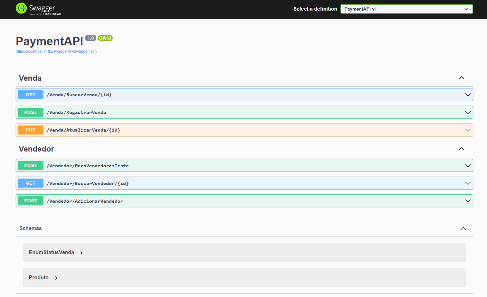
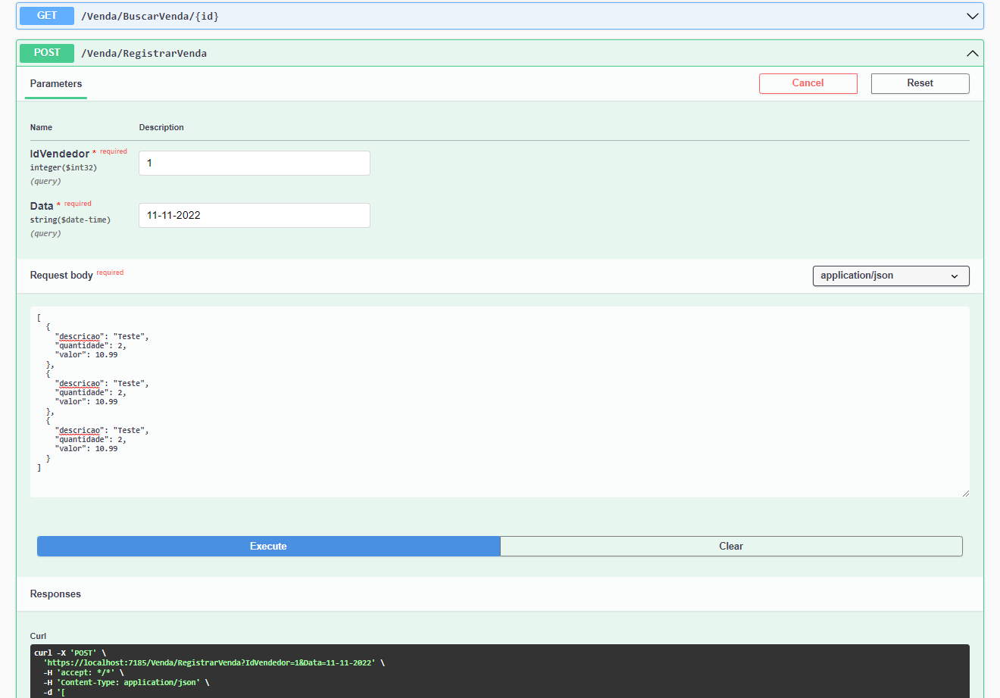
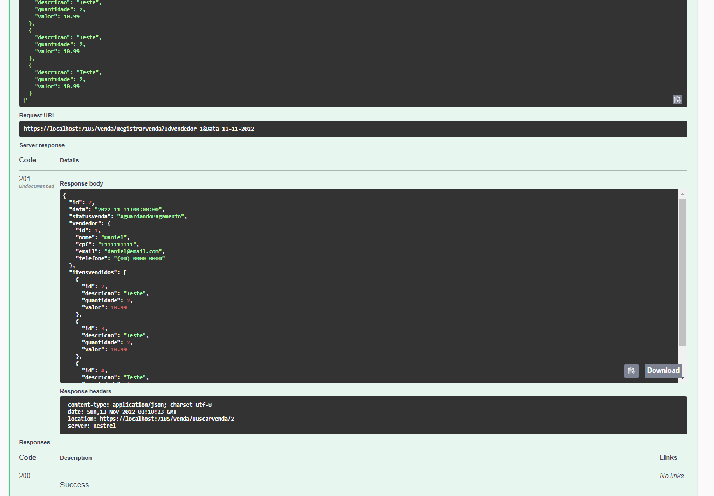
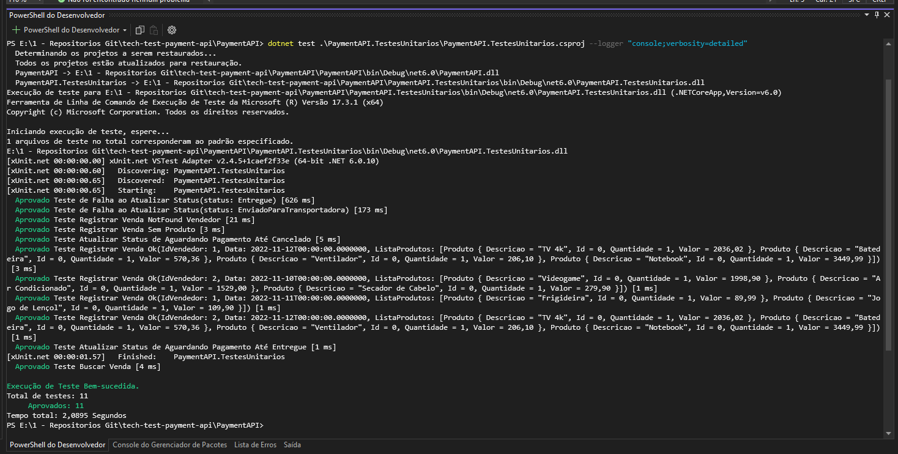
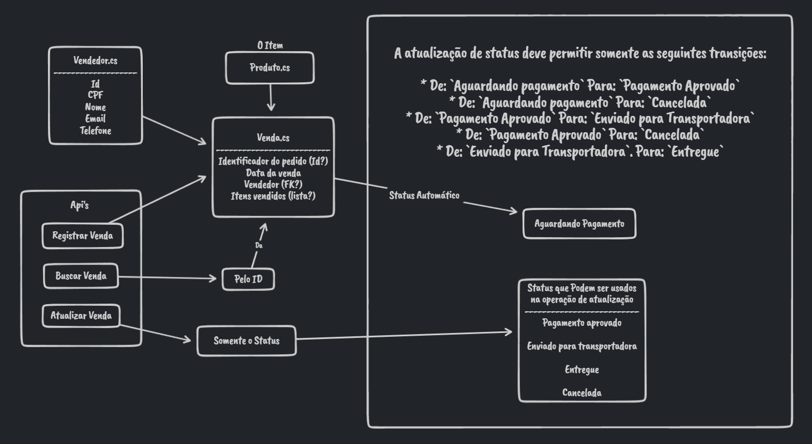

# PROJETO CONCLUÍDO
## INFORMAÇÕES BASICAS
- O projeto foi programado em .Net 6
- Utilizei o pacote nuget EntityFrameworkCore.InMemory para simular uma database na memoria.

---

## EVIDÊNCIAS DE FUNCIONAMENTO
Algumas evidencias que posso prover são imagens do Swagger e dos Testes Unitários.

### Imagens do Swagger com as APIs: 

O Swagger pode ser acessado através do link: https://localhost:7185/swagger/index.html 
   
  
  

 

### Imagem dos Testes Unitários:  

---

## CONCLUSÃO 
Cheguei aqui neste teste oferecido pela Pottencial através do bootcamp de dotnet da DIO, o qual me ensinou muitas coisas. Ao fazer este projeto me deparei com algumas dificuldades, a primeira delas era "por onde começar?" o que me levou a desenvolver um mapinha do projeto, é parecido com um diagrama, mas muito mais simples e nada regrado, mas me ajudou muito a contextualizar o necessário para iniciar o projeto:  

  

Após isso alguns dos problemas que enfrentei eu percebi facilmente que eram por falta de experiência, a qual este projeto já me rendeu alguma e espero conseguir mais e mais ao longo da minha carreira.  
Mas de todos os problemas, a minha maior dificuldade com certeza foi com o teste unitário, pois não havia nada além de uma breve citação sobre eles no bootcamp, cheguei a pensar em simplesmente não fazer mas resolvi abraçar o desafio e corri atrás de informações através de vídeos, artigos e principalmente as documentações da microsoft, e após algumas dificuldades finalmente compreendi o básico, e a sensação de recompensa por ter conseguido fazer foi maravilhosa. Claramente sem desafios não há evolução, então devemos sempre abraçar os desafios.    

Eu adorei ter participado do bootcamp, ele foi bem proveitoso, e adorei os desafios propostos por este projeto que me deram dicas do caminho para seguir com meus estudos.

   

---  

   

   

# README ORIGINAL:
## INSTRUÇÕES PARA O TESTE TÉCNICO

- Crie um fork deste projeto (https://gitlab.com/Pottencial/tech-test-payment-api/-/forks/new). É preciso estar logado na sua conta Gitlab;
- Adicione @Pottencial (Pottencial Seguradora) como membro do seu fork. Você pode fazer isto em  https://gitlab.com/`your-user`/tech-test-payment-api/settings/members;
 - Quando você começar, faça um commit vazio com a mensagem "Iniciando o teste de tecnologia" e quando terminar, faça o commit com uma mensagem "Finalizado o teste de tecnologia";
 - Commit após cada ciclo de refatoração pelo menos;
 - Não use branches;
 - Você deve prover evidências suficientes de que sua solução está completa indicando, no mínimo, que ela funciona;

## O TESTE
- Construir uma API REST utilizando .Net Core, Java ou NodeJs (com Typescript);
- A API deve expor uma rota com documentação swagger (http://.../api-docs).
- A API deve possuir 3 operações:
  1) Registrar venda: Recebe os dados do vendedor + itens vendidos. Registra venda com status "Aguardando pagamento";
  2) Buscar venda: Busca pelo Id da venda;
  3) Atualizar venda: Permite que seja atualizado o status da venda.
     * OBS.: Possíveis status: `Pagamento aprovado` | `Enviado para transportadora` | `Entregue` | `Cancelada`.
- Uma venda contém informação sobre o vendedor que a efetivou, data, identificador do pedido e os itens que foram vendidos;
- O vendedor deve possuir id, cpf, nome, e-mail e telefone;
- A inclusão de uma venda deve possuir pelo menos 1 item;
- A atualização de status deve permitir somente as seguintes transições: 
  - De: `Aguardando pagamento` Para: `Pagamento Aprovado`
  - De: `Aguardando pagamento` Para: `Cancelada`
  - De: `Pagamento Aprovado` Para: `Enviado para Transportadora`
  - De: `Pagamento Aprovado` Para: `Cancelada`
  - De: `Enviado para Transportador`. Para: `Entregue`
- A API não precisa ter mecanismos de autenticação/autorização;
- A aplicação não precisa implementar os mecanismos de persistência em um banco de dados, eles podem ser persistidos "em memória".

## PONTOS QUE SERÃO AVALIADOS
- Arquitetura da aplicação - embora não existam muitos requisitos de negócio, iremos avaliar como o projeto foi estruturada, bem como camadas e suas responsabilidades;
- Programação orientada a objetos;
- Boas práticas e princípios como SOLID, DDD (opcional), DRY, KISS;
- Testes unitários;
- Uso correto do padrão REST;
